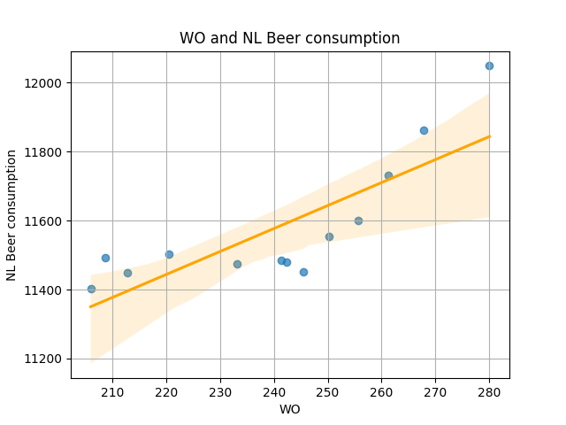

Student Number: 14431394

# 1. Title of the papers

## MCC Van Dyke et al., 2019: 
Fantastic yeasts and where to find them: the hidden diversity of dimorphic fungal pathogens

## JT Harvey, Applied Ergonomics, 2002:
An analysis of the forces required to drag sheep over various surfaces

## DW Ziegler et al., 2005:
The neurocognitive effects of alcohol on adolescents and college students

# 2. Plot

## Interpretation:
The plot displays a positive correlation between WO and beer consumption in the Netherlands. However, it is questionable whether this is association is representative of anything meaningful.